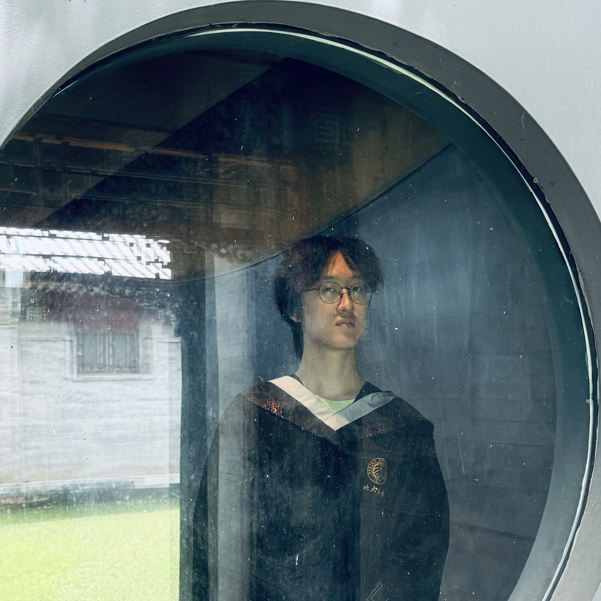

 
    

 <b>Bowen Shi</b>   <em>Phd Student</em> 

 <a href="https://oden.utexas.edu" target="blank">Oden Institute for Computational Engineering and Sciences</a> 
<a href="https://utexas.edu" target="blank">The University of Texas at Austin</a>

 <a href="files/Bowen_Shi_CV_3-11.pdf">Curriculum vitae </a> 

 

Hi! I am a first year PhD student at Oden Institute, UT Austin. I received my B.S. in Computational Mathematics from [School of Mathematical Sciences](http://english.math.pku.edu.cn), [Peking University](https://www.pku.edu.cn) in July, 2024. At Peking University, I was fortunate to work with [Prof. Jun Hu](https://scholar.google.com/citations?user=LEa7b6YAAAAJ&hl=zh-TW) and [Dr. Kaibo Hu](https://kaibohu.github.io) on Finite Element Exterior Calculus. I also worked with [Dr. Pengzhan Jin](https://scholar.google.com/citations?user=W3cOoCYAAAAJ&hl=en).

