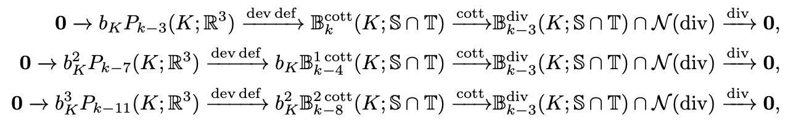

## Research Interests
**I am intereted in developing efficient, reliable and mathematically solid algorithms to accelerate scientific computation.**

At PKU, I focused on the numerical analysis of the finite element methods. Particularly, I was fascinated by their deep connection with discrete geometry, homological algebra and exterior calculus. The discrete exact sequences of a Bernstein-Galfand-Galfand diagram are closely related to structure-preserving discretization of the corresponding PDE. I spent a summer working with Dr. Kaibo Hu on the finite elemet discretization of the conformal deformation complex. From a homological perspective, we revealed the intrinsic supersmoothness of symmetric and traceless finite elements, and showed the stability via explicit construction of the hierachical bubble complexes. [Paper](https://arxiv.org/abs/2311.16077), [A brief introduction in Chinese](https://zhuanlan.zhihu.com/p/683009268)

|  |
| :------: |
| **The hierachical bubble conformal complexes on a single tetrahedron** |

 
